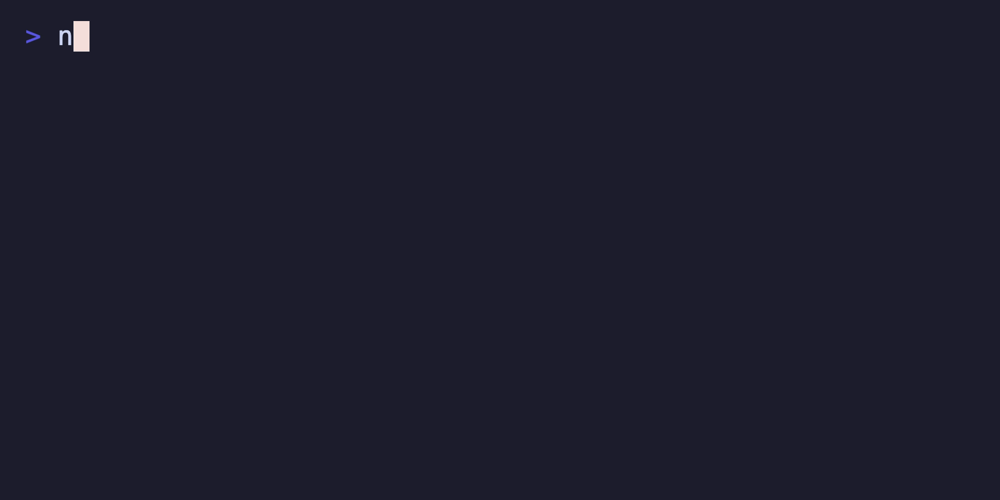

# @suds-cli/help

Render short or full help text from your key bindings. Ported from the Charm `bubbles/help` component.



```ts
import { HelpModel } from "@suds-cli/help";

const help = HelpModel.new({ width: 80 });
const text = help.view(keyMap);
```


