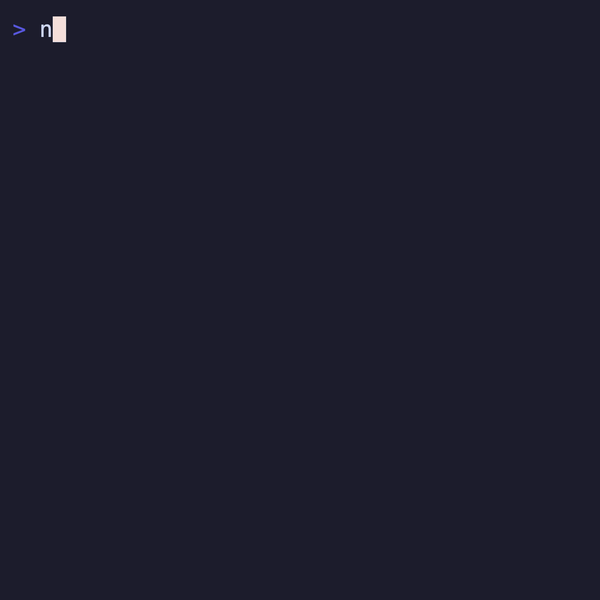

# @boba-cli/list

Filterable, selectable list with integrated help, spinner, and paginator. Ported from the Charm `bubbles/list` component.



## Usage

```ts
import { DefaultItem, ListModel } from '@boba-cli/list'

const list = ListModel.new({
  items: [new DefaultItem('Item 1'), new DefaultItem('Item 2')],
  title: 'Example',
  showFilter: true,
})

const [next, cmd] = [list.startLoading()[0], list.startLoading()[1]]
```
