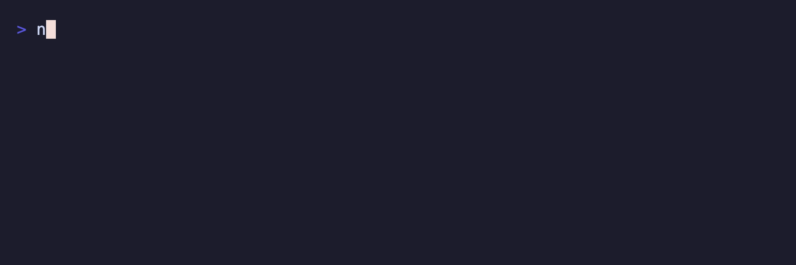

# @suds-cli/progress

Animated progress bar for Suds terminal UIs. Port of Charmbracelet Bubbles progress.



## Install

```bash
pnpm add @suds-cli/progress
```

## Quickstart

```ts
import { ProgressModel, FrameMsg } from "@suds-cli/progress";
import type { Cmd, Msg } from "@suds-cli/tea";

let progress = ProgressModel.withDefaultGradient({ width: 30 });

function init(): Cmd<Msg> {
  // Start at 40%
  const [next, cmd] = progress.setPercent(0.4);
  progress = next;
  return cmd;
}

function update(msg: Msg): [unknown, Cmd<Msg>] {
  const [next, cmd] = progress.update(msg);
  progress = next;
  return [{ progress }, cmd];
}

function view(): string {
  return progress.view();
}
```

## API

- `ProgressModel.new(options?)` create with defaults
- `ProgressModel.withDefaultGradient()` convenience gradient
- `ProgressModel.withGradient(colorA, colorB, scale?)`
- `ProgressModel.withSolidFill(color)`
- `setPercent(percent)` set target percent (0-1) and start animation
- `incrPercent(delta)` adjust target percent
- `update(msg)` handle `FrameMsg` animation ticks
- `view()` render bar; `percent()` exposes animated percent

## Scripts

- `pnpm -C packages/progress build`
- `pnpm -C packages/progress test`
- `pnpm -C packages/progress lint`
- `pnpm -C packages/progress generate:api-report`

## License

MIT


