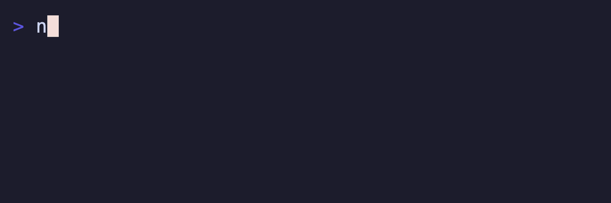

# @suds-cli/spinner

Animated spinner component for Suds terminal UIs. Port of Charmbracelet Bubbles spinner.



## Install

```bash
pnpm add @suds-cli/spinner
```

## Quickstart

```ts
import { SpinnerModel, TickMsg, dot } from "@suds-cli/spinner";
import { Style } from "@suds-cli/chapstick";
import type { Cmd, Msg, Model } from "@suds-cli/tea";

// Create a spinner with custom style
const spinner = new SpinnerModel({
  spinner: dot,
  style: new Style().foreground("#7c3aed"),
});

// In your model's init, start the spinner
function init(): Cmd<Msg> {
  return spinner.tick();
}

// In your update function, handle TickMsg
function update(msg: Msg): [MyModel, Cmd<Msg>] {
  if (msg instanceof TickMsg) {
    const [nextSpinner, cmd] = spinner.update(msg);
    return [{ ...model, spinner: nextSpinner }, cmd];
  }
  return [model, null];
}

// In your view, render the spinner
function view(): string {
  return `Loading ${spinner.view()}`;
}
```

## Built-in Spinners

| Spinner | Preview |
|---------|---------|
| `line` | `\| / - \` |
| `dot` | `⣾ ⣽ ⣻ ⢿ ⡿ ⣟ ⣯ ⣷` |
| `miniDot` | `⠋ ⠙ ⠹ ⠸ ⠼ ⠴ ⠦ ⠧ ⠇ ⠏` |
| `jump` | `⢄ ⢂ ⢁ ⡁ ⡈ ⡐ ⡠` |
| `pulse` | `█ ▓ ▒ ░` |
| `points` | `∙∙∙ ●∙∙ ∙●∙ ∙∙●` |
| `globe` | `🌍 🌎 🌏` |
| `moon` | `🌑 🌒 🌓 🌔 🌕 🌖 🌗 🌘` |
| `monkey` | `🙈 🙉 🙊` |
| `meter` | `▱▱▱ ▰▱▱ ▰▰▱ ▰▰▰` |
| `hamburger` | `☱ ☲ ☴` |
| `ellipsis` | `. .. ...` |

## Custom Spinners

```ts
import type { Spinner } from "@suds-cli/spinner";

const customSpinner: Spinner = {
  frames: ["◐", "◓", "◑", "◒"],
  fps: 100, // milliseconds per frame
};

const model = new SpinnerModel({ spinner: customSpinner });
```

## API

| Export | Description |
|--------|-------------|
| `SpinnerModel` | Main component model |
| `Spinner` | Interface for spinner definitions |
| `TickMsg` | Message for animation ticks |
| `line`, `dot`, etc. | Built-in spinner animations |

### SpinnerModel Methods

| Method | Description |
|--------|-------------|
| `id()` | Unique ID for message routing |
| `tick()` | Command to start/continue animation |
| `update(msg)` | Handle messages, returns `[model, cmd]` |
| `view()` | Render current frame with style |
| `withSpinner(s)` | New model with different spinner |
| `withStyle(s)` | New model with different style |

## Scripts

- `pnpm -C packages/spinner build`
- `pnpm -C packages/spinner test`
- `pnpm -C packages/spinner lint`
- `pnpm -C packages/spinner generate:api-report`

## License

MIT


