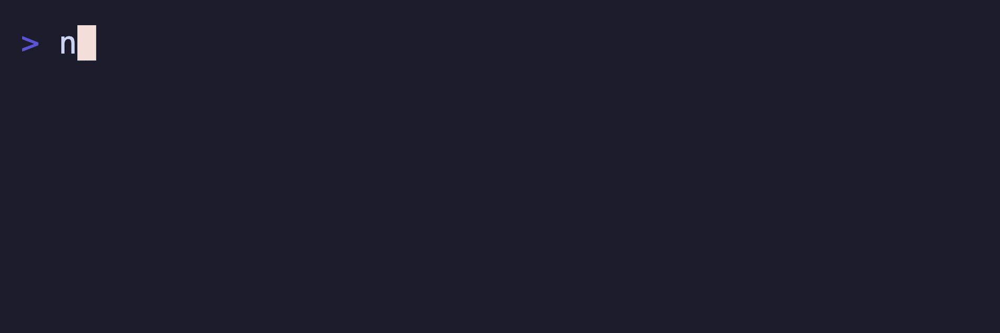

# @boba-cli/stopwatch

Stopwatch component for Boba terminal UIs. Port of Charmbracelet Bubbles stopwatch.



## Install

```bash
pnpm add @boba-cli/stopwatch
```

## Quickstart

```ts
import { StopwatchModel, TickMsg } from '@boba-cli/stopwatch'
import type { Cmd, Msg, Model } from '@boba-cli/tea'

const stopwatch = StopwatchModel.new()

function init(): Cmd<Msg> {
  return stopwatch.init()
}

function update(msg: Msg): [Model, Cmd<Msg>] {
  if (msg instanceof TickMsg) {
    const [next, cmd] = stopwatch.update(msg)
    return [{ ...model, stopwatch: next }, cmd]
  }
  return [model, null]
}

function view(): string {
  return `Elapsed ${stopwatch.view()}`
}
```

## API

| Export             | Description                         |
| ------------------ | ----------------------------------- |
| `StopwatchModel`   | Stopwatch model                     |
| `StopwatchOptions` | Options for creating a stopwatch    |
| `TickMsg`          | Tick message carrying ID/tag        |
| `StartStopMsg`     | Message to start/stop the stopwatch |
| `ResetMsg`         | Message to reset elapsed time       |

### StopwatchModel methods

| Method                            | Description                             |
| --------------------------------- | --------------------------------------- |
| `id()`                            | Unique ID for message routing           |
| `running()`                       | Whether the stopwatch is active         |
| `elapsed()`                       | Milliseconds elapsed                    |
| `init()`                          | Start ticking on init                   |
| `update(msg)`                     | Handle messages, returns `[model, cmd]` |
| `view()`                          | Render elapsed time                     |
| `start()/stop()/toggle()/reset()` | Control commands                        |

## Scripts

- `pnpm -C packages/stopwatch build`
- `pnpm -C packages/stopwatch test`
- `pnpm -C packages/stopwatch lint`
- `pnpm -C packages/stopwatch generate:api-report`

## License

MIT
