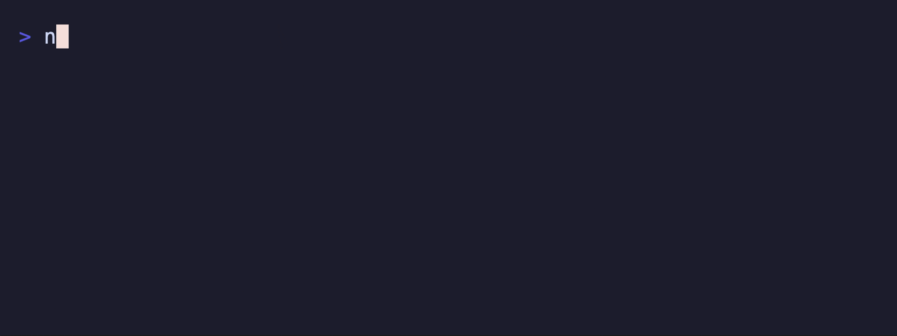

# @suds-cli/textarea

Multi-line textarea component for Suds terminal UIs. Early port of Charmbracelet Bubbles textarea.



## Install

```bash
pnpm add @suds-cli/textarea
```

## Quickstart

```ts
import { TextareaModel } from "@suds-cli/textarea";
import type { Cmd, Msg } from "@suds-cli/tea";

let editor = TextareaModel.new({
  placeholder: "Write your note...",
  width: 60,
  maxHeight: 5,
  showLineNumbers: true,
});

function init(): Cmd<Msg> {
  const [focused, cmd] = editor.focus();
  editor = focused;
  return cmd;
}

function update(msg: Msg): [typeof model, Cmd<Msg>] {
  const [next, cmd] = editor.update(msg);
  editor = next;
  return [model, cmd];
}

function view(): string {
  return editor.view();
}
```

## Features (current slice)

- Multi-line editing with grapheme-aware cursor
- Insert/delete, newline, delete line, duplicate line
- Line navigation (up/down/start/end), scrolling with maxHeight
- Optional line numbers and prompt prefix
- Placeholder rendering when empty
- Clipboard paste (ctrl+v) via `clipboardy`
- Validation callback support

## Key bindings (defaults)

- Move: `up/down`, `home/end`
- Insert newline: `enter`
- Delete char: `backspace`, `delete`
- Delete line: `ctrl+u`
- Paste: `ctrl+v`
- Quit keys are provided by your app, not the component

## Scripts

- `pnpm -C packages/textarea build`
- `pnpm -C packages/textarea test`
- `pnpm -C packages/textarea lint`
- `pnpm -C packages/textarea generate:api-report`

## Notes / gaps

- Horizontal scrolling and wrapping are minimal; long lines render fully.
- Memoization from the Go version is not yet ported.
- Selection support is not yet implemented.


