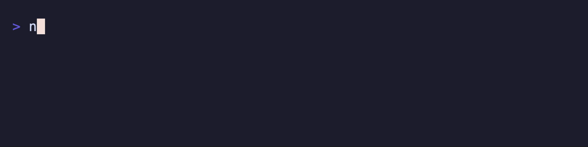

# @suds-cli/timer

Countdown timer component for Suds terminal UIs. Port of Charmbracelet Bubbles timer.



## Install

```bash
pnpm add @suds-cli/timer
```

## Quickstart

```ts
import { TimerModel, TickMsg, TimeoutMsg } from "@suds-cli/timer";
import type { Cmd, Msg, Model } from "@suds-cli/tea";

const timer = TimerModel.new({ timeout: 30_000 }); // 30 seconds

function init(): Cmd<Msg> {
  return timer.init();
}

function update(msg: Msg): [Model, Cmd<Msg>] {
  if (msg instanceof TickMsg || msg instanceof TimeoutMsg) {
    const [nextTimer, cmd] = timer.update(msg);
    return [{ ...model, timer: nextTimer }, cmd];
  }
  return [model, null];
}

function view(): string {
  return `Remaining ${timer.view()}`;
}
```

## API

| Export | Description |
|--------|-------------|
| `TimerModel` | Countdown timer model |
| `TimerOptions` | Options for creating a timer |
| `TickMsg` | Tick message carrying ID/tag/timeout flag |
| `TimeoutMsg` | Message emitted when timer expires |
| `StartStopMsg` | Message to start/stop the timer |

### TimerModel methods

| Method | Description |
|--------|-------------|
| `id()` | Unique ID for message routing |
| `running()` | Whether the timer is active |
| `timedOut()` | Whether the timer has expired |
| `init()` | Start ticking on init |
| `update(msg)` | Handle messages, returns `[model, cmd]` |
| `view()` | Render remaining time |
| `start()/stop()/toggle()` | Control commands |

## Scripts

- `pnpm -C packages/timer build`
- `pnpm -C packages/timer test`
- `pnpm -C packages/timer lint`
- `pnpm -C packages/timer generate:api-report`

## License

MIT


