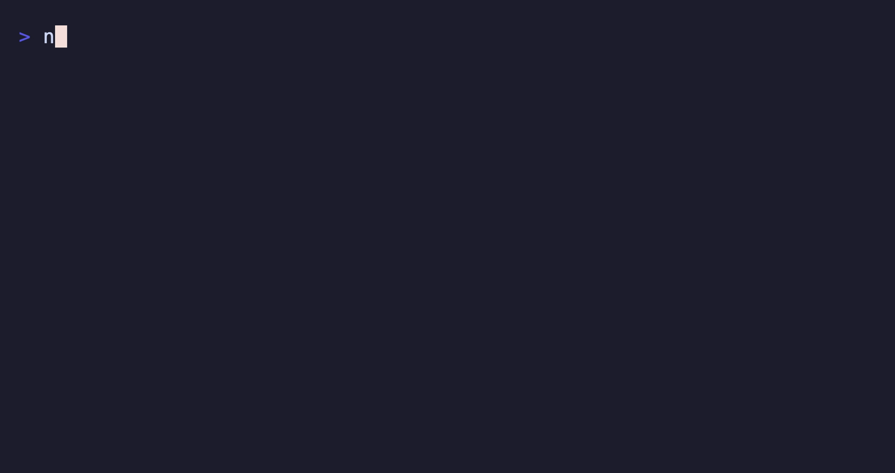

> **Deprecation Notice:** This package is being renamed from `@suds-cli/viewport` to `@boba-cli/viewport`. Please update your dependencies accordingly.

# @suds-cli/viewport

Scrollable content window for Suds terminal UIs. Ported from the Charm `bubbles/viewport` component.



## Usage

```ts
import { ViewportModel } from '@suds-cli/viewport'

const viewport = ViewportModel.new({ width: 80, height: 10 }).setContent(
  longText,
)

const [next] = viewport.update(keyMsg) // responds to j/k, pgup/pgdown, etc.

// Render visible slice
console.log(next.view())
```
